# M.M.A MASTERS

The project's primary goal is to expand the online presence from only three social media: Facebook, Twitter, and Youtube, to a website targeting a more significant number of potential customers, and make The M.M.A Masters a well-known icon among mixed martial art enthusiasts, which will lead to an increase in the volume of business. The Academy is located in Dublin city center and provides various martial arts classes: Brazilian Ju-Jitsu, Boxing, Muay Thai. The website's main target is martial arts fans, people who want to learn self-defense, and people who want to get fit.

## Features

The website is divided into three separate pages: a home page, a lessons page,  and a contact page.
The home page contains a Header that is composed of a navbar and banner. The main section includes a warning, welcome section, facts section, and testimonial section, and at the bottom of the page, there is a  Footer. 
The lessons page contains a navbar, lessons overview section, lessons section, warning, and equipment section. At the bottom of the page, there is a  Footer.
The contact page contains a navbar, contact section, opening hours section, and at the bottom of the page, there is a  Footer.
#### The Navigation Bar

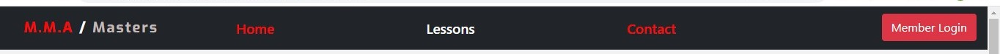

Featured on all three pages, build in Bootsrap fully responsive, includes links to the Logo, Home page,  links to other two pages, and a Button for members login only visible on a big screen with min-width 992px. On smaller screens, the navigation item has replaced the Button. The navigation bar is identical on each page to allow for easy Navigation.
The Navigation bar will permit the user to find what he is looking for in an easy way.

#### The Footer

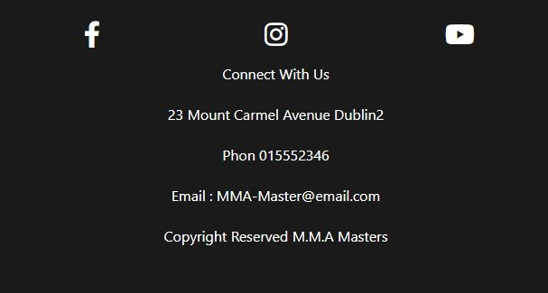

The Footer is located at the bottom of every page of the website.
The Footer links the website to social media and contains a general information email address, phone number, address, and copyrights.

####  Warning 

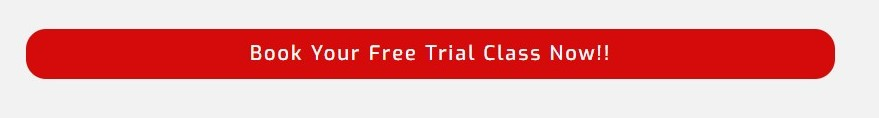

The warning informs the user of the possiblity of  booking a free trial class and is linked to contact pages where the user cant book a free trial class .the warning is located on the home page and lessons page. This section encourages the user to visit the academy, which may result in becoming a member.

### Home page

#### Banner

##### The banner image that aperars on screen with max-widht of 576px

##### The banner image that aperars on screen with min-widht of 576px

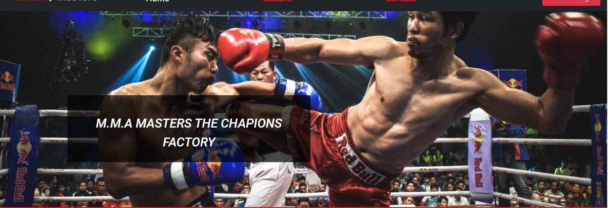

The Banner contains a background image and a heading.  This section was designed to capture a visitor's interest and encourage staying on the website for further browsing. 

#### Welcome section

Welcome Section is composed of the primary heading and a welcoming paragraph that describes M.M.A Masters Akademy and the benefits of becoming a member. The same Section also contains three different subsections philosophy subsections that describe the academy's ideology, Focus subsection, which tells your primary focus as a member; Mission Subsection, which represents the academy's mission.

#### Facts Section

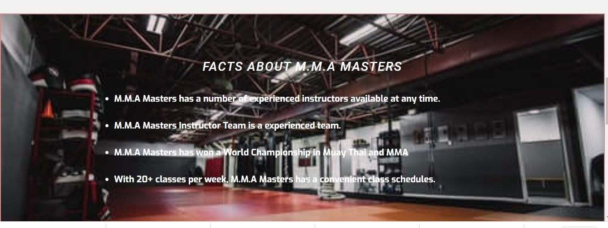

The Facts section is composed of a heading and an unordered list that quotes facts about the academy. The section is placed on top of a  background image. This part of the landing page was designed to attract the user's attention and highlight facts about M.M.A Masters.

### testimonial section

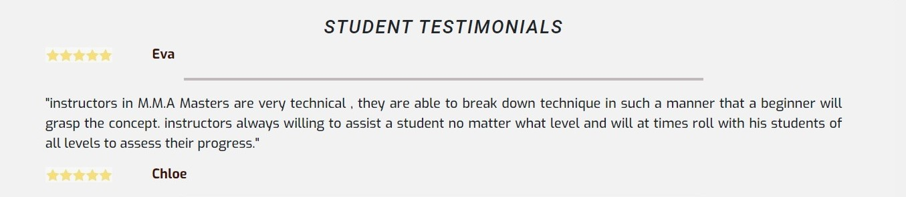

The testimonial section is composed of the testimonial's heading and the students testimonial. This section aims to elevate Customer confidence and solve issues by following better business practices that will further improve customer experience.
 
### lessons page 

#### Lessons Overview

Lessons overview contains a heading and general description of available classes. 

#### Lessons

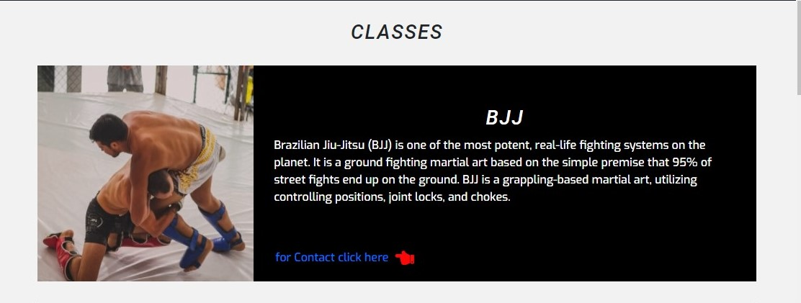

 The lessons section quotes all available classes provided by the academy. The primary aims of this section are to inform the user of the available classes.

 ### Equipment section

 The equipment section is composed of a heading and paragraph which describe the equipment required. This section aims To highlight the safety and inform the user about the equipment required during the training sessions.

 ### Cantact page

 #### Contact section

 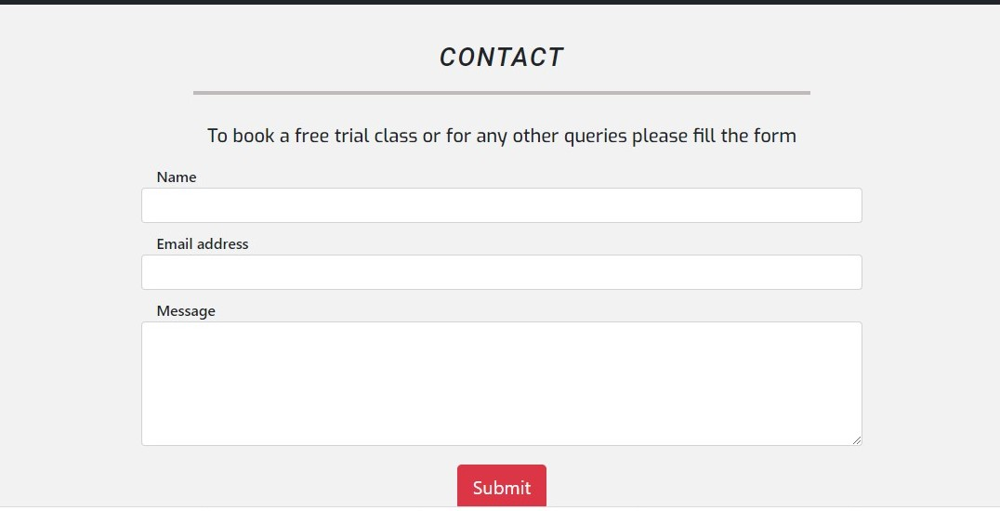

The contact section is composed of a heading and a form that asks the user for contact information, name, email, and a text area to provide a message. This section allows the user to contact the customer service department directly for any queries. This section aims to improve customer service and communication. 

#### Opening hours section

The opening hours section is composed of heading and text. this section was designed to inform the user about the opening hours of the gym without the need to contact the customer service.

#### Login

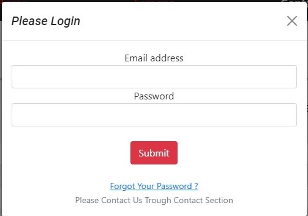

Login is triggered by clicking on Member Login Button on the screens with a minimum width of 992  px. On a smaller screen, the login appearson  a navbar as one of the options.

### Features Left to Implement
1. An online shop of MMA equipment.
2. MMA blog.
3. Section to promote all the sportive events.

technologies Used

## testing
Extensive testing was performed to ensure that the website works the way that it was designed to work.

### The Navbar

The Navbar is fully responsive, built-in bootstrap, and heavily modified to suit the user's needs.  
The sticky  Navbar that consistently maintains the menu anchored while users are scrolling avoids having to scroll up to get to the bar when they want to browse other sections. The Navbar contains the logo with a link to the main page and five menu items: Home, lessons, contact, login, and button for member login. The first three items in Navbar are dedicated to each page of the website. Both the login button and login item are triggering the login box to appear on the screen. All these features implemented in Navbar aim to help users quickly access all information that the website offers. In screens with min-width 992px,the button is visible, and the login item is hidden. In screens with max-width 992px the button is hidden, and the login item is visible; 

 Image displaying the Navbar on screens screens with min-width 576px

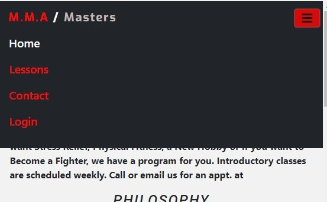

 Image displaying the navbar on screensscreens with max-width 576 

### The Footer

The Footer is built in CSS Grid, and it's fully responsive. The footer signals to the user that they have reached the end of the webpage and provides links to social media. And encourage the users to visit the academy on facebook, youtube, and Twitter, which is helping to increase the number of followers on this media. And also provides general info email, phone, address, and copyrights.

 Image displaying the footer on screens with max-widht 576 px.

Image displaying the footer on screens with min-widht 576 px.

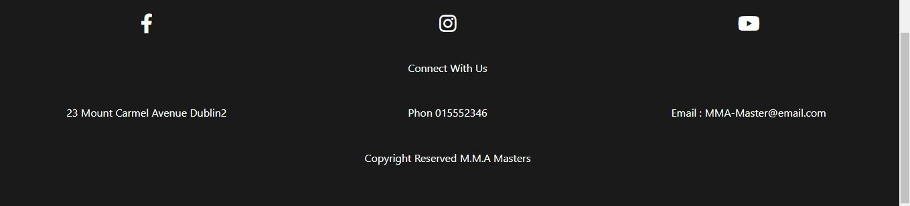

### The Warning

The warning informs the user of the possibility of booking a free trial class and is linked to contact pages where the user cant book a free trial class. The Warning section aims to encourage the users to physically visit the gym, making them more likely to become members.
The warning on screens with max-width 992 px takes 90% of screen width. On-screen with width above 992 px, it takes only 60%  of screen width.

### Main Page

#### Banner

The Banner is the most visible part of the landing page where the visitors usually land, creating a focus point, capturing visitors' interest, and encouraging staying on the website for further browsing.
The Banner contains a heading overlaying the banner image. The image and the hading are changing with the screen width.

Image displaying the banner on screens with max-widht 576 px.

Image displaying the banner on screens with min-widht 576 px.

# Welcome Section

It is not immediately apparent to the user what the website is about; The welcome section makes sure that he clearly understands the purpose of the website.It is not immediately apparent to the users what the website is about; The welcome section makes sure that he clearly understands the website's purpose. And also, it tells the  users in as few words as possible what they can find and achieve on the website.
The Welcome Section is build using CSS Grid, and it's fully responsive to all screen sizes.
In screens with max-width 576px every subsection take 100% of screen width.
In screens with max-width 992px, the Welcome subsection take 100% of screen width. the Philosophy and Focus subsections are located below the welcome subsection and take 50% of screen width each. The Mission subsection is located below the Philosophy and Focus sections in the middle of the screen and takes one-third of the screen width.
In screens with a min-width 992 px, the Welcome subsection takes 100% of screen width. The Philosophy, Focus, and Mission subsections are located below the welcome subsection and take one-third of the screen width each.

### Facts Section

The fact section contains text quoting positive facts about the business and overlays a background image. This section aims to give the user a positive feeling and to encourage them to further browsing.
the image is responsive; its height changes with the width of the screen to make sure that all the section content stays inside the section frames  

### Testimonial Section

The Testimonial section was created to establish credibility, as referrals, convince visitors that they can rely on the  Academy, explain how beneficial our service can be, and solve issues by following better business practices that will further improve customer experience.
Testimonial Section is fundamental from the business point of view that's why it should be visible, and it always takes 100% of the screen with in all screen sizes.

### Lessons  Section

The lesson's section was created to attract a more significant number of recipients by showing the possibility of choosing a martial art class to the predispositions of potential future school students. It arouses various age groups' interests well as multiple environments. To attract attention, photos differ and change according to the screen size. 
This section is build using a CSS Grid, and it's fully responsive. In screens, with max-width 992 px, the lessons section takes 100% of the screen width, and every lesson starts by heading with a lesson's name and text with the description, which takes 100% of screen width. Then, below the text, there is  a lesson's image, which also takes 100% of the screen width.
On-screen, with a min-width of 992px, the image and the description text are horizontally beside each other on the same height and combined take 90% of the screen width with a margin of 5% on the left and the right.

### Contact Section

The contact section contains a form with all the basics necessary to contact the school: email, name, and text area for a message. It is clear and straightforward and encourages users to ask questions without complications or difficulties, and it is also used to book a free trial class.

### Opening Hours
Opening Hours section helps deliver a personalized customer experience without wasting the user's time or waiting without proper communication. The customer is well informed about the opening hours. 

#### Login

Login is triggered by clicking on Member Login Button on the screens with a minimum width of 992  px. On a smaller screen, the login appears one a navbar as one of the options.

### Browser Testing

The website has been tested on Chrome, Vivaldi, Opera, Edge, Firefox, and Internet explorer. No problems were found on any of them exclude Explorer. The issue was to be a lack of support on the Internet Explorer for the CSS grid. The image below represents the website on internet explorer.

## Validator Testing

### HTML Testing

The testing was performed on the V3C HTML validator by direct input before deploying to the Gitpages. The image below shows all the bugs found.

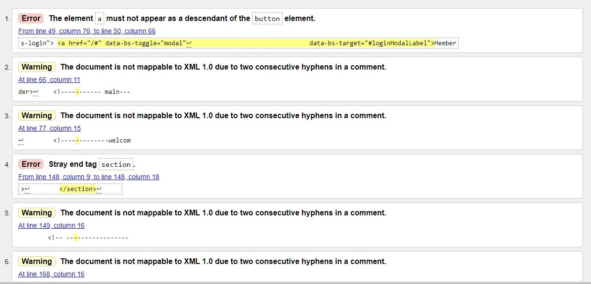

1. The error on position 1 was fixed by removing the button from the anchor tag.
2. The warnings on position  2 were fixed by removing white spaces from comments. 
3. The error on position 4 was fixed by removing the end section tag, which was not on the scope.

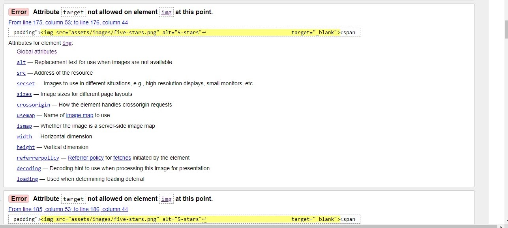

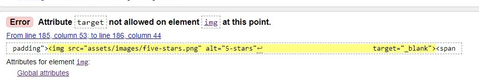

the two similar errors, which are on the two images on the top, were fixed by removing the target attribute from the images

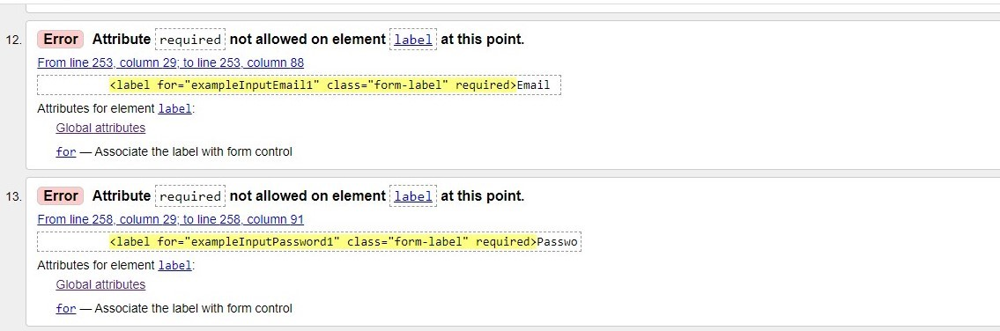

The errors on the positions 12, 13 on the image above were caused by placing the attribute required in the label of a form instead of the input tag .the errors were fixed by replacing the attribute required from the label tag to the input tag.

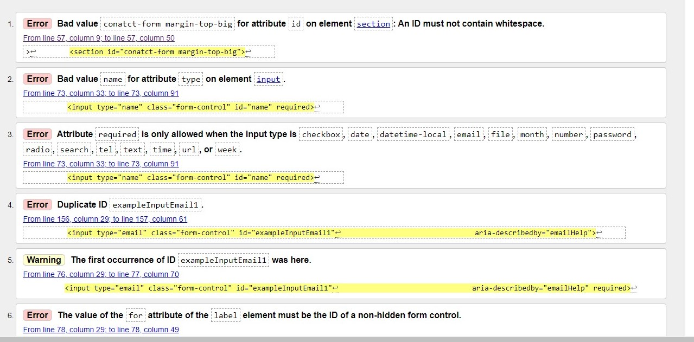

The error on position 1 on the image above was caused by placing a class margin-top-big defined in style.css  us a value for an id inside section's tag in HTML file. The class was removed and placed inside a div below the section's tag to fix the error.
The errors on positions 2, 3 on the image above were caused by
giving the value of the name to type attribute inside the input tag. To fix these errors, the values of type attributes were changed to text.
The two errors on position 4, 6 and the warning on position 5 on the image above were caused by a similar id value inside the member login button (the modal) and the contact form located on the contact page.
The fix for the errors was changing the value of each id

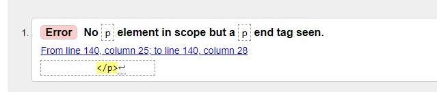

The error on the image above was fixed by removing the end of paragraph tag, which was not on the scope.

##### Al bugs inside html file were fixed 

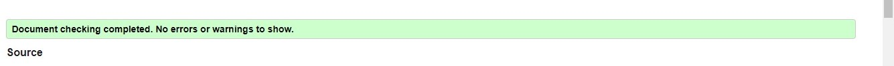

### CSS Testing

The testing was performed on the V3C CSS validator by direct input before deploying to the Gitpages. The image below shows all the bugs found.

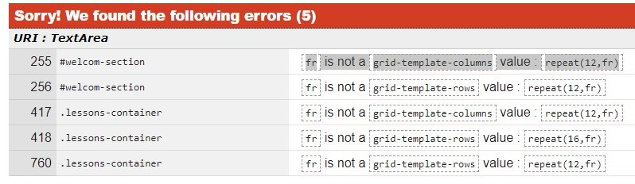

All the bugs found in the CSS file were caused by improper use of the function repeat() while designing the layout using the CSS grid. The function was written repeat(Number of row or column, fr) instead of repeat(Number of row or column, 1fr), but the design worked in the browser. The errors were found during the validation in the V3C validator.  When the correct form of the repeat function was used (repeat(Number of row or column, 1fr)), the layout of the sections designed in the CSS grid completely changed. The final fix for the issue was using auto (repeat(Number of row or column, auto)) instead of fractional unit.

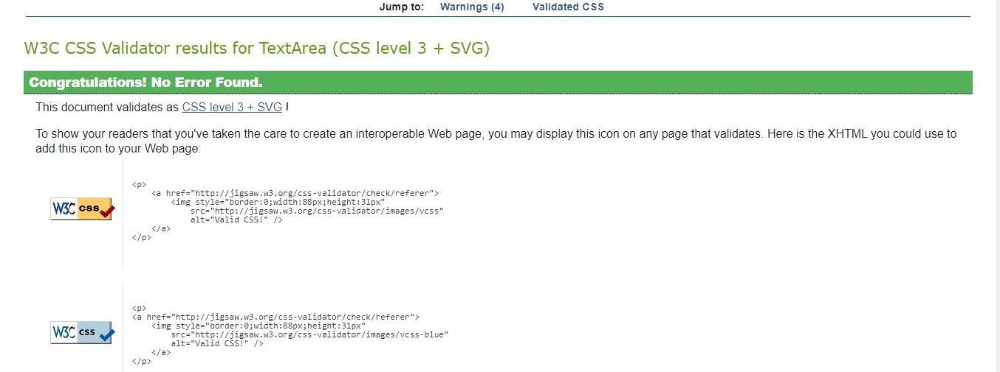

### Unfixed Bugs

After deploying the website end performing a CSS check in the V3C CSS validator, the following errors and warnings appeared,which are caused by the bootstrap library.

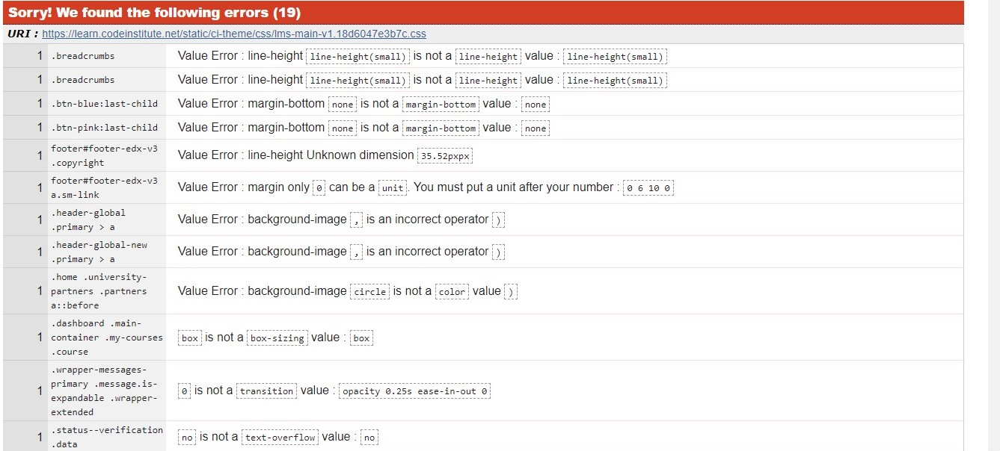

## Deployment

The site was deployed to GitHub pages. The steps to deploy are as follows:
1. In the GitHub repository, navigate to the Settings tab
2. From the source section drop-down menu, select the Master Branch
3. Once the master branch has been selected, the page will be automatically display the link to the website.

 The live link can be found here - [live link to MMA Masters](https://uskawi.github.io/M.M.A-Masters/)

### Making a clone to run locally

1. Log into GitHub.
2. Select the respository.
3. Click the Code dropdown button next to the green Gitpod button.
4. Download ZIP file and unpackage locally and open with IDE. Alternatively copy the URL in the HTTPS box.
5. Open the alternative editor and terminal window.
6. Type 'git clone' and paste the copied URL.
7. Press Enter. A local clone will be created.

 ## Credits

 ### Images

1. The banner images was obtained from Pablo Rebolledo on unsplash.com
2. The fighter.jpg image was obtained from Damir Spanic on upsplash.com
3. The bjj-sm.jpg image was obtained Bruno Bueno from Pexels
4. bjj-md.jpg image  was obtained from Jonathan Borba on upsplash.com
5. boxing-md.jpg image  was obtained from Zachary Kadolph on upsplash.com
6. boxing-md.jpg image  was obtained from  Jonathan Tomas on upsplash.com
7. facts.jpg image was obtained from Anastase Marago on upsplash.com
8. mma-md.jpg image  was obtained from Nemesia Production on upsplash.com
9. mma-sm.jpg image  was obtained from Katerina Kerdi on upsplash.com
10. muaytahi-sm jpg image  was obtained from Jonathan Tomas on upsplash.com
11. muaytahi-md jpg image  was obtained from Nick Wang on upsplash.com
12. 5stars.png was was obtained from vippng.com

### Code

The part of the code in the image bellow was obtained from the frontendresource [link to fron end rescource](https://frontendresource.com/css-background-image-color/)

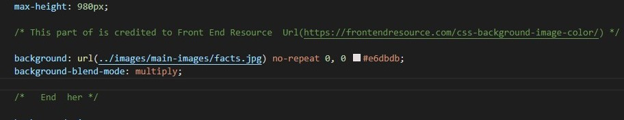

### Content 

The text for the Home page Welcome section and the text for lessons page for the lessons overview section and  lessons section  was taken from   https://evolve-mma.com/classes/

