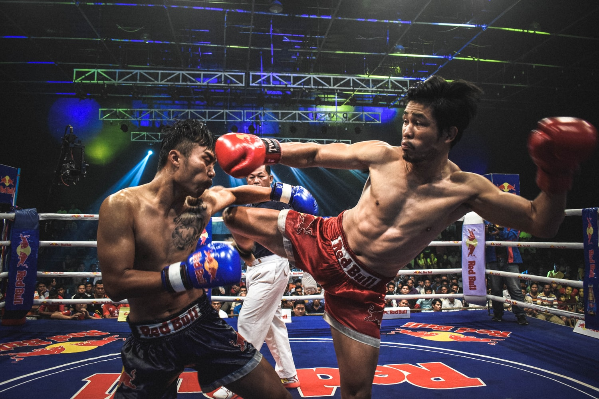

# M.M.A MASTERS

The project's primary goal is to expand the online presence from only three social media: Facebook, Twitter, and Youtube, to a website. The website can be accessed by everyone with an internet connection that offers detailed information about fictional martial arts academy M.M.A Masters. The Academy is located in Dublin city center and provides various martial arts classes: Brazilian Ju-Jitsu, Boxing, Muay Thai, and M.M.A.The website's main target is martial arts fans, people who want to learn self-defense, and people who want to get fit.

## Features

The website is divided into three separate pages: a home page, a lessons page,  and a contact page.
The home page contains a Header that is composed of a navbar and banner. The main section includes a warning, welcome section, facts section, and testimonial section, and at the bottom of the page, there is a  Footer. 
The lessons page contains a navbar, lessons overview section, lessons section, warning, and equipment section. At the bottom of the page, there is a  Footer.
The contact page contains a navbar, contact section, opening hours section, and at the bottom of the page, there is a  Footer.
#### The Navigation Bar

Featured on all three pages, build in Bootsrap fully responsive, includes links to the Logo, Home page,  links to other two pages, and a Button for members login only visible on a big screen with min-width 992px. On smaller screens, the navigation item has replaced the Button. The navigation bar is identical on each page to allow for easy Navigation.
The Navigation bar will permit the user to find what he is looking for in an easy way.

#### The Footer

The Footer is located at the bottom of every page of the website.
The Footer links the website to social media and contains a general information email address, phone number, address, and copyrights.

####  Warning 

The warning informs the user to book a free trial class and is linked to contact pages where the user cant book a free trial class .the warning is located on the home page and lessons page. This section encourages the user to visit the academy, which may result in becoming a member.

### Home page

#### Banner

##### The banner image that aperars on screen with max-widht of 576px

##### The banner image that aperars on screen with min-widht of 576px

The Banner contains a background image and a heading.  This section was designed to capture a visitor's interest and encourage staying on the website for further browsing. 
#### Welcome section

Welcome Section is composed of the main heading and a welcoming paragraph that describes M.M.A Masters Akademy and the benefits of becoming a member. the same Section also contains three different subsections philosophy subsection that describes the ideology that the academy follows, Focus subsection, which describes what would be your primary focus  as a member, Mission Subsection, which represents the mission that the academy want to achieve .

#### Facts Section

The Facts section is composed of a heading and an unordered list that quotes facts about the academy. The section is placed on top of a  background image. This part of the landing page was designed to attract the attention of the user and  to highlight facts about M.M.A Masters

### testimonial section

The testimonial section is composed of the testimonial's heading and the student's testimonial. This section aims to elevate Customer confidence and solve issues by following better business practices that will further improve customer experience.
 
### lessons page 

#### Lessons Overview

Lessons overview contains a heading and general description of available classes. 

#### Lessons

 The lessons section quotes all available classes provided by the academy. The primary aims of this section are to inform the user of the available classes.

 ### Equipment section

 The equipment section is composed of a heading and paragraph which described the equipment required. This section aims to inform the user of the equipment needed to be safe during the training.

 ### Cantact page

 #### Contact section

The contact section is composed of a heading and a form that asks the user for contact information, name, email, and a text area to provide a message. This section allows the user to contact the customer service department directly for any queries. This section aims to improve customer service and communication. 

#### Opening hours section

